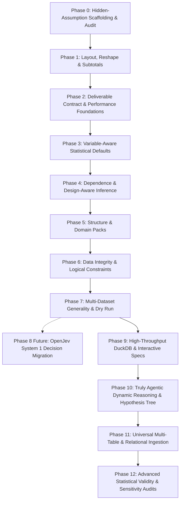

# Master Implementation Plan — Executing FutureScope

This master plan provides the complete, self-contained engineering blueprint to execute [`FutureScope.md`](file:///d:/(Dev2)DSA_AGENT/FutureScope.md). It is structured so that any fresh agent session can read this document, pick up a specific Phase, and execute it flawlessly with zero ambiguity.

---

## 1. Rules of Engagement & Core Directives

Every phase and system implemented under this plan **must strictly comply** with these non-negotiable rules from [`AGENTS.md`](file:///d:/(Dev2)DSA_AGENT/AGENTS.md) and [`FutureScope.md:§2`](file:///d:/(Dev2)DSA_AGENT/FutureScope.md#L21-L33):

| Rule | Directive | Enforced By |
| :--- | :--- | :--- |
| **Property-Keyed** | Key every system on a data property (from Section 4), never on a domain name. | Architecture review |
| **Applies-To Gating** | Gate every system via `applies_to(profile)`. If the property is absent, runtime and prompt cost must be **~0**. | `tests/test_applies_to.py` |
| **Generality Rule (3-Test Gate)** | Every new system must ship with: (1) a **planted case** that is found, (2) a **null case** that does not fire, and (3) **two structurally different datasets** where it does not silently misfire. | `pytest tests/` |
| **Layer Separation** | Reasoning in `src/core/`, Execution tools in `src/tools/`. Tools never drive controller or engine behavior. | `tests/test_architecture.py` |
| **Deterministic First** | Every system must work with the LLM disabled (`--no-llm`). The LLM selects, explains, or adapts; it never replaces tested statistical code. | `main.py --no-llm` smoke tests |
| **Disclose, Don't Hide** | Any repair (nulling placeholders, reshaping wide data, excluding subtotal rows) must be recorded on the `ReadReport` / `Finding` with exact numbers. | `ReadReport`, `Finding` |
| **Performance Budget** | The deterministic baseline must not get slower. Benchmark check must pass. | `python scripts/bench.py --check` |
| **Zero Linter/Type Errors** | Zero violations allowed before completing any wave or phase. | `ruff check .`, `mypy src/` |

---

## 2. Execution Architecture & Phased Overview



### Execution Status Scorecard

| Phase | Description | Status | Verification / Objective |
| :--- | :--- | :---: | :--- |
| **Phase 0** | Hidden-Assumption Scaffolding & Audit | **COMPLETE** | `tests/test_hidden_assumptions.py` (9/9 passed) |
| **Phase 1** | Layout Detection, Wide-to-Long & Subtotals | **COMPLETE** | `tests/test_layout_detection.py` (6/6 passed) |
| **Phase 2** | Deliverable Contract & Question Router | **COMPLETE** | 13 tests passed across 3 suites |
| **Phase 3** | Variable-Aware Statistical Defaults | **COMPLETE** | 12 tests passed across 2 suites |
| **Phase 4** | Dependence- & Design-Aware Inference | **COMPLETE** | `tests/test_dependence_and_causal.py` (8/8 passed) |
| **Phase 5** | Structure-Specific & Domain-Specific Analyses | **COMPLETE** | `tests/test_domain_packs_and_graph.py` (6/6 passed) |
| **Phase 6** | Data Integrity & Constraint Discovery | **COMPLETE** | `tests/test_integrity.py` (6/6 passed) |
| **Phase 7** | Multi-Dataset Generality & Dry Run | **COMPLETE** | `tests/test_e2e_generality.py` (5/5 passed), `dry_run.py` (40/40 checks passed) |
| **Phase 8** | OpenJev System 1 Decision Migration | **FUTURE SCOPE** | Post-Phase 7 non-blocking track |
| **Phase 9** | High-Throughput Vector & Visual Engine | **COMPLETE** | `tests/test_duckdb_engine.py` (5/5), `tests/test_chart_specs.py` (3/3) |
| **Phase 10** | Truly Agentic Dynamic Reasoning | **COMPLETE** | `tests/test_hypothesis_tree.py` (2/2), `tests/test_dynamic_interrupts.py` (2/2) |
| **Phase 11** | Universal Multi-Entity Ingestion | **COMPLETE** | `tests/test_multi_tab_excel.py` (2/2), `tests/test_relational_joiner.py` (1/1), `tests/test_deep_json.py` (1/1) |
| **Phase 12** | Advanced Statistical Validity & Sensitivity | **COMPLETE** | `tests/test_sensitivity.py` (2/2), `tests/test_target_leakage.py` (1/1), `tests/test_smart_imputation.py` (2/2) |

---

## 3. Detailed Phase Specifications

---

### Phase 0: Hidden-Assumption Scaffolding & Section 4 Audit
*Objective: Build test fixtures for all 15 hidden assumptions ([`FutureScope.md:§8`](file:///d:/(Dev2)DSA_AGENT/FutureScope.md#L395-L414)) to serve as regression barriers for all subsequent phases.*

#### Files to Create / Modify:
* [NEW] [`tests/fixtures/hidden_assumptions.py`](file:///d:/(Dev2)DSA_AGENT/tests/fixtures/hidden_assumptions.py): Synthetic datasets specifically breaking assumptions:
  1. Header on row 3 with title/metadata on rows 1–2, blank rows, footnotes below.
  2. Subtotal and total rows mixed with unit records.
  3. Wide "time in the header" table (`t1..tn` and year columns `2019, 2020, 2021`).
  4. Non-independent rows: serial autocorrelation, cluster-nested rows (students in schools).
  5. Ordinal/Likert scales and compositional share columns where raw means/correlations fail.
  6. Censored values (`<LOD`, `>100`), heaped values (ages ending in 0/5), Benford anomalies.
* [NEW] [`tests/test_hidden_assumptions.py`](file:///d:/(Dev2)DSA_AGENT/tests/test_hidden_assumptions.py): Asserts pipeline either handles each case cleanly or issues a plain-language explanation of why a method does not apply.
* [MODIFY] [`FutureScope.md`](file:///d:/(Dev2)DSA_AGENT/FutureScope.md): Audit Section 4 status column against active code in `src/`.

**Exit Gate**: `pytest tests/test_hidden_assumptions.py` passes (asserting graceful detection or explicit warning).

---

### Phase 1: Layout Detection, Wide-to-Long Reshape & Subtotal Rows
*Objective: Prevent messy spreadsheets from silently corrupting analysis ([`FutureScope.md:§5.1`](file:///d:/(Dev2)DSA_AGENT/FutureScope.md#L198-L215)).*

#### Files to Modify:
* [MODIFY] [`src/core/io.py`](file:///d:/(Dev2)DSA_AGENT/src/core/io.py):
  * `detect_table_layout(raw_bytes: bytes, suffix: str) -> TableLayout`:
    * Sniff header offset (row index of actual column names).
    * Detect spacer/blank rows and trailing notes/footnotes.
    * Parse multi-row headers into hierarchical or merged column names.
  * `detect_and_exclude_subtotals(df: pd.DataFrame) -> tuple[pd.DataFrame, SubtotalExclusionReport]`:
    * Scan for rows where text columns contain `Total`, `Subtotal`, `Sum`, `All`, or where numeric row values equal the sum of previous rows.
    * Exclude them from the primary dataframe; record excluded row count and indices in `ReadReport`.
  * `detect_wide_time_headers(df: pd.DataFrame) -> WideReshapeSpec | None`:
    * Recognize column names matching years (`1990..2030`), months (`Jan..Dec`, `01..12`), weeks, or sequence markers (`t0..tn`).
    * Reshape wide tables to long format (`id_vars`, `time_var`, `value_var`) so time-series and panel tools activate.
* [MODIFY] [`src/core/profiler.py`](file:///d:/(Dev2)DSA_AGENT/src/core/profiler.py):
  * Record `layout_detected` and `reshaped_from_wide` in `DatasetProfile`.
* [NEW] [`tests/test_layout_detection.py`](file:///d:/(Dev2)DSA_AGENT/tests/test_layout_detection.py):
  * **Planted**: Multi-row header spreadsheet + total row + wide World Bank table.
  * **Null**: Standard clean CSV (`iris.csv`).
  * **Diverse**: UCI AirQuality (clean) vs messy financial statement (multi-table layout).

**Exit Gate**: All planted subtotals excluded; wide data automatically converted to long panel; zero regressions on `AirQualityUCI.csv`.

---

### Phase 2: Deliverable Contract, Question Router & Performance Foundations
*Objective: Guarantee user asks are delivered, route question intents, and speed up planning ([`FutureScope.md:§5.6, §5.8, §5.10`](file:///d:/(Dev2)DSA_AGENT/FutureScope.md#L295-L302)).*

#### Files to Create / Modify:
* [NEW] [`src/core/deliverable_contract.py`](file:///d:/(Dev2)DSA_AGENT/src/core/deliverable_contract.py):
  * `parse_deliverable_contract(objective: str) -> DeliverableContract`:
    * Extract requested chart types (e.g. heatmap, scatter, bar), specific target drivers, segment comparisons, and forecasts.
  * `audit_deliverables(contract: DeliverableContract, final_result: dict[str, Any]) -> DeliverableAuditReport`:
    * Check if all required deliverables exist in `final_result["charts"]` and `final_result["findings"]`.
    * For any missing deliverable, trigger a deterministic recipe to generate it before final exit.
* [NEW] [`src/core/question_router.py`](file:///d:/(Dev2)DSA_AGENT/src/core/question_router.py):
  * `route_question_family(objective: str) -> QuestionFamily`:
    * Map objective to Axis E families (*describe, compare, associate, predict, explain, forecast, detect, segment, monitor, audit*).
    * Provide typed dispatching for deterministic tool selection.
* [MODIFY] [`src/core/controller.py`](file:///d:/(Dev2)DSA_AGENT/src/core/controller.py):
  * **Speculative Baseline Execution**: Kick off deterministic baseline tools immediately while LLM plans in parallel. If LLM adds steps, merge them; if LLM fails or times out, baseline results are already complete.
  * **Shared Analysis Context**: Compute correlation matrix, common group aggregates, and ranks once and store in `MemorySystem.analysis_context`.
* [NEW] [`tests/test_deliverable_contract.py`](file:///d:/(Dev2)DSA_AGENT/tests/test_deliverable_contract.py)
* [NEW] [`tests/test_question_router.py`](file:///d:/(Dev2)DSA_AGENT/tests/test_question_router.py)

**Exit Gate**: The `AirQualityUCI.csv` live objective (*"heatmap of monthly average per pollutant, what drives CO levels"*) delivers all requested deliverables deterministically even if LLM planning fails.

---

### Phase 3: Variable-Aware Statistical Defaults
*Objective: Apply statistically valid methods based on measurement scales ([`FutureScope.md:§5.2`](file:///d:/(Dev2)DSA_AGENT/FutureScope.md#L217-L234)).*

#### Files to Modify:
* [MODIFY] [`src/tools/statistical_analysis.py`](file:///d:/(Dev2)DSA_AGENT/src/tools/statistical_analysis.py):
  * **Count Models**: Detect non-negative integer columns with overdispersion (variance >> mean); use Poisson/negative-binomial rates per unit exposure rather than linear means.
  * **Compositional Handling**: Detect share columns summing to ~1.0 or 100%; apply isometric/centered log-ratio (CLR) transforms before correlation.
  * **Circular Statistics**: Detect directional/periodic variables (0–360° or hour 0–23); compute circular mean and dispersion ($\bar{\theta} = \text{atan2}(\sum \sin \theta, \sum \cos \theta)$).
  * **Ordinal & Robust Defaults**: On heavy-tailed data or Likert scales, use medians, trimmed means, and Mann-Whitney/Kruskal-Wallis tests instead of raw t-tests and Pearson correlations.
  * **Heaping & Benford Forensics**: Test digit preference (excess zeros/fives) and first-digit Benford distribution.
* [MODIFY] [`src/core/profiler.py`](file:///d:/(Dev2)DSA_AGENT/src/core/profiler.py):
  * Tag column measurement scales: `count`, `compositional`, `circular`, `ordinal`, `heavy_tailed`.
* [NEW] [`tests/test_variable_aware_methods.py`](file:///d:/(Dev2)DSA_AGENT/tests/test_variable_aware_methods.py):
  * Test count overdispersion, circular hour-23/hour-0 distance, and compositional spurious correlation prevention.

**Exit Gate**: Circular mean of 23:00 and 01:00 correctly computes to 00:00 (midnight); compositional shares do not produce spurious negative Pearson correlations.

---

### Phase 4: Dependence- and Design-Aware Inference
*Objective: Guard against false discoveries caused by dependence, confounding, and selection bias ([`FutureScope.md:§5.3`](file:///d:/(Dev2)DSA_AGENT/FutureScope.md#L235-L260)).*

#### Files to Create / Modify:
* [NEW] [`src/core/dependence.py`](file:///d:/(Dev2)DSA_AGENT/src/core/dependence.py):
  * `effective_sample_size(series: pd.Series) -> float`: Adjust sample size for serial autocorrelation: $n_{\text{eff}} = n \frac{1 - \rho_1}{1 + \rho_1}$.
  * `cluster_robust_se(frame: pd.DataFrame, formula: str, cluster_col: str)`: Compute cluster-robust standard errors for nested entities.
  * `simpsons_paradox_check(frame: pd.DataFrame, x: str, y: str, confounders: list[str]) -> list[SimpsonsWarning]`: Stratify by top confounders and verify if subgroup slopes flip sign.
* [MODIFY] [`src/core/claim_verification.py`](file:///d:/(Dev2)DSA_AGENT/src/core/claim_verification.py):
  * **Causal-Claim Guard**: Check whether findings use causal phrasing ("causes", "drives", "impacts", "due to"). If the dataset lacks an experimental design (randomized arms/blocks), automatically downgrade phrasing to associative language ("associated with", "correlates with").
* [MODIFY] [`src/core/controller.py`](file:///d:/(Dev2)DSA_AGENT/src/core/controller.py):
  * **No-Inference Mode**: When `profile.is_census` or deterministic simulation is detected, suppress p-values and output effect sizes with plain-language explanations.
* [NEW] [`tests/test_dependence_aware.py`](file:///d:/(Dev2)DSA_AGENT/tests/test_dependence_aware.py)

**Exit Gate**: Planted Simpson's paradox is flagged; observational findings with causal verbs are systematically downgraded.

---

### Phase 5: Data Integrity & Logical Constraints
*Objective: Discover physical and logical bounds and missingness mechanisms ([`FutureScope.md:§5.5`](file:///d:/(Dev2)DSA_AGENT/FutureScope.md#L284-L294)).*

#### Files to Modify:
* [MODIFY] [`src/core/relations.py`](file:///d:/(Dev2)DSA_AGENT/src/core/relations.py):
  * Extend formula relations to inequality and ordering constraints:
    * `end_date >= start_date`, `high >= low`, `part <= total`, `balance >= 0`.
    * Emit an integrity finding listing violating row count and row IDs.
  * **Missingness Mechanism Check**:
    * Test whether missing values occur in temporal blocks, or correlate significantly with other variables (informative/non-random missingness).
* [NEW] [`tests/test_integrity_constraints.py`](file:///d:/(Dev2)DSA_AGENT/tests/test_integrity_constraints.py)

**Exit Gate**: Discovers inverted timestamps or high < low rows; flags block-missingness in sensor data.

---

### Phase 6: Domain Packs & Cross-Shape Corpus
*Objective: Domain intelligence through structured data files, verified across 16 domain groups ([`FutureScope.md:§5.7, §7`](file:///d:/(Dev2)DSA_AGENT/FutureScope.md#L303-L315)).*

#### Files to Create / Modify:
* [NEW] [`src/core/domain_packs/`](file:///d:/(Dev2)DSA_AGENT/src/core/domain_packs/):
  * `loader.py`: Schema validator for domain packs (YAML/JSON).
  * `schema.json`: Schema defining reference tables, regulatory limits, KPI formulas, and preferred methods.
  * Initial Packs:
    * `air_quality.json`: WHO / EU limits for CO, NOx, PM2.5, PM10 averaging windows.
    * `saas_ecommerce.json`: Churn, LTV, conversion, cohort retention benchmarks.
* [NEW] [`tests/fixtures/cross_shape_corpus/`](file:///d:/(Dev2)DSA_AGENT/tests/fixtures/cross_shape_corpus/):
  * Create one representative fixture dataset per property combination spanning the 16 domain groups ([`FutureScope.md:L366-370`](file:///d:/(Dev2)DSA_AGENT/FutureScope.md#L366-L370)).
* [NEW] [`tests/test_cross_shape_corpus.py`](file:///d:/(Dev2)DSA_AGENT/tests/test_cross_shape_corpus.py):
  * Run generality verification across all 16 domains.

**Exit Gate**: Air quality analysis automatically cites WHO limit exceedances; SaaS analysis computes LTV/churn with domain-standard definitions.

---

### Phase 7: Structure-Specific Analyses on Demand
*Objective: Activate specialized structural analyses only when data topology warrants it ([`FutureScope.md:§5.4`](file:///d:/(Dev2)DSA_AGENT/FutureScope.md#L261-L283)).*

#### Files to Create:
* [NEW] [`src/tools/graph_analysis.py`](file:///d:/(Dev2)DSA_AGENT/src/tools/graph_analysis.py):
  * Triggered by: Edge list (two ID columns sharing a value space).
  * Measures: Degree distribution, connected components, hub centrality, community detection.
* [NEW] [`src/tools/event_log.py`](file:///d:/(Dev2)DSA_AGENT/src/tools/event_log.py):
  * Triggered by: Uneven timestamped event streams with entities.
  * Measures: Sessionization, funnel transition rates, inter-arrival burstiness.
* [NEW] [`src/tools/trajectory.py`](file:///d:/(Dev2)DSA_AGENT/src/tools/trajectory.py):
  * Triggered by: Entity × Time × Coordinates.
  * Measures: Trip segmentation, dwell points, velocity outliers.
* [NEW] [`tests/test_structure_specific_tools.py`](file:///d:/(Dev2)DSA_AGENT/tests/test_structure_specific_tools.py)

**Exit Gate**: Graph edge list activates `graph_analysis`; regular tabular data ignores it with 0 overhead.

---

### Phase 8 (Future / Optimization): OpenJev System 1 Decision Migration
*Objective: Replace LLM routing and claim-guard passes with zero-latency, non-autoregressive decision models ([`FutureScope.md:§5.8`](file:///d:/(Dev2)DSA_AGENT/FutureScope.md#L320-L344)).*

#### Files to Create / Modify:
* [NEW] [`src/core/openjev_client.py`](file:///d:/(Dev2)DSA_AGENT/src/core/openjev_client.py):
  * In-process or local daemon runner for OpenJev open weights.
  * Implements `route_stage2()` and `verify_finding()`.
* [MODIFY] [`src/core/controller.py`](file:///d:/(Dev2)DSA_AGENT/src/core/controller.py):
  * When `ENABLE_OPENJEV=true`, route Stage 2 questions and claim verification through OpenJev.
* [NEW] [`tests/test_openjev_client.py`](file:///d:/(Dev2)DSA_AGENT/tests/test_openjev_client.py)

**Exit Gate**: Stage 2 decision latency drops from ~30 s to <50 ms; zero JSON repair retries.

---

### Phase 9: High-Throughput Execution Engine & Interactive Visual Specs (Fast)
*Objective: Eliminate single-threaded Pandas bottlenecks and Matplotlib disk rasterization latency ([`FutureScope.md:§5.11`](file:///d:/(Dev2)DSA_AGENT/FutureScope.md)).*

#### Files to Create / Modify:
* [NEW] [`src/core/duckdb_engine.py`](file:///d:/(Dev2)DSA_AGENT/src/core/duckdb_engine.py):
  * `query_dataframe(df: pd.DataFrame, sql: str) -> pd.DataFrame`: In-memory zero-copy querying of DataFrames using DuckDB.
  * Vectorized multi-column aggregations, groupbys, and rolling window operations.
* [MODIFY] [`src/tools/visualization.py`](file:///d:/(Dev2)DSA_AGENT/src/tools/visualization.py) & [`src/core/controller.py`](file:///d:/(Dev2)DSA_AGENT/src/core/controller.py):
  * `generate_chart_spec(chart_type: str, data: dict[str, Any], **kwargs) -> dict[str, Any]`: Output standard Plotly / Vega-Lite JSON specs.
  * Store specs in `final_result["chart_specs"]` for direct interactive rendering in the Streamlit frontend.
  * Reduce Matplotlib PNG generation to background export or opt-in.
* [NEW] [`tests/test_duckdb_engine.py`](file:///d:/(Dev2)DSA_AGENT/tests/test_duckdb_engine.py) & [`tests/test_chart_specs.py`](file:///d:/(Dev2)DSA_AGENT/tests/test_chart_specs.py)

**Exit Gate**: Chart generation drops from ~2.5s to <15ms; groupbys on 500k rows execute in <250ms with 0 memory bloat.

---

### Phase 10: Truly Agentic Dynamic Reasoning & Hypothesis Trees (Truly Agentic)
*Objective: Break out of static linear tool queues with interrupt signals and an active hypothesis tree ([`FutureScope.md:§5.12`](file:///d:/(Dev2)DSA_AGENT/FutureScope.md)).*

#### Files to Create / Modify:
* [NEW] [`src/core/hypothesis.py`](file:///d:/(Dev2)DSA_AGENT/src/core/hypothesis.py):
  * `HypothesisTree`, `HypothesisNode`, and `CounterfactualVerifier`: Tracks active hypotheses ($H_0$), verification tests, and refutation pivots.
* [MODIFY] [`src/tools/base.py`](file:///d:/(Dev2)DSA_AGENT/src/tools/base.py):
  * Add `InterruptSignal` exception and result protocol for tools to flag broken statistical assumptions (e.g. 95% zero-inflation, extreme multimodal clustering).
* [MODIFY] [`src/core/controller.py`](file:///d:/(Dev2)DSA_AGENT/src/core/controller.py):
  * In `_execute_steps`, intercept `InterruptSignal`: halt remaining queue steps, update context with discovery, and trigger an immediate dynamic micro-replan.
* [NEW] [`tests/test_dynamic_interrupts.py`](file:///d:/(Dev2)DSA_AGENT/tests/test_dynamic_interrupts.py) & [`tests/test_hypothesis_tree.py`](file:///d:/(Dev2)DSA_AGENT/tests/test_hypothesis_tree.py)

**Exit Gate**: A tool encountering broken assumptions (e.g. extreme zero inflation) halts linear plan execution and dynamically swaps to an appropriate model.

---

### Phase 11: Universal Multi-Entity & Complex Document Ingestion (Accepts All Data)
*Objective: Ingest real-world enterprise artifacts: multi-tab Excel workbooks, relational bundles, and deep JSON ([`FutureScope.md:§5.13`](file:///d:/(Dev2)DSA_AGENT/FutureScope.md)).*

#### Files to Create / Modify:
* [MODIFY] [`src/core/io.py`](file:///d:/(Dev2)DSA_AGENT/src/core/io.py):
  * `_read_excel`: Inspect all sheets in `.xlsx`. Auto-concatenate identical period sheets; expose multi-schema workbooks as relational bundles.
  * `_read_json`: Add recursive nested dictionary and list unrolling (`json_normalize` with array path explode).
* [NEW] [`src/core/relational_joiner.py`](file:///d:/(Dev2)DSA_AGENT/src/core/relational_joiner.py):
  * `discover_foreign_keys(tables: dict[str, pd.DataFrame]) -> list[ForeignKeyRelation]`: Detects 1:N and 1:1 join keys via Jaccard value overlap and naming conventions.
  * `assemble_star_schema(tables: dict[str, pd.DataFrame], relations: list[ForeignKeyRelation]) -> pd.DataFrame`: Auto-assembles a unified analytical dataset.
* [NEW] [`tests/test_multi_tab_excel.py`](file:///d:/(Dev2)DSA_AGENT/tests/test_multi_tab_excel.py) & [`tests/test_relational_joiner.py`](file:///d:/(Dev2)DSA_AGENT/tests/test_relational_joiner.py)

**Exit Gate**: Multi-tab Excel workbook is automatically unified; multi-CSV upload auto-joins into star schema without manual SQL.

---

### Phase 12: Advanced Statistical Validity & Sensitivity Audits (Quality)
*Objective: Eliminate hidden bias from naive imputation, leverage points, and target leakage ([`FutureScope.md:§5.14`](file:///d:/(Dev2)DSA_AGENT/FutureScope.md)).*

#### Files to Create / Modify:
* [NEW] [`src/core/sensitivity.py`](file:///d:/(Dev2)DSA_AGENT/src/core/sensitivity.py):
  * `audit_finding_sensitivity(df: pd.DataFrame, finding: Finding) -> SensitivityReport`: Jackknife perturbation of top findings (dropping top 1% leverage points); flags fragile claims.
  * `detect_target_leakage(df: pd.DataFrame, target_col: str) -> list[LeakageWarning]`: Screens features for mutual info > 0.95 or timestamps post-dating target occurrence.
* [MODIFY] [`src/tools/data_processing.py`](file:///d:/(Dev2)DSA_AGENT/src/tools/data_processing.py):
  * In `CleanDataTool`, use MICE / IterativeImputer when `src/core/integrity.py` detects MAR missingness.
* [NEW] [`tests/test_sensitivity.py`](file:///d:/(Dev2)DSA_AGENT/tests/test_sensitivity.py) & [`tests/test_target_leakage.py`](file:///d:/(Dev2)DSA_AGENT/tests/test_target_leakage.py)

**Exit Gate**: Findings dependent on outlier leverage points receive `[FRAGILE]` warnings; predictive models warn on target leakage features.

---

## 4. Universal Quality Gates (Run Every Wave)

To mark any wave or phase complete, execute the following commands in powershell:

```powershell
# 1. Linting & formatting check
ruff check .

# 2. Strict static type check
mypy src/

# 3. Unit test suite
pytest tests/ -v

# 4. Built-in registry, schema, and dry-run validation
python scripts/validate.py
python scripts/dry_run.py

# 5. Performance benchmark regression check (must not regress > 25%)
python scripts/bench.py --check
```

---

## 5. Protocol for Starting a New Session

When starting a fresh session to implement any phase from this plan, use the following prompt:

```text
Implement FutureScope Phase <N> following implementation_plan.md and FutureScope.md.
Rules:
1. Every system must be keyed on a data property, gated by applies_to, and cost ~0 when absent.
2. Comply strictly with AGENTS.md (type hints PEP 484, separation of src/core and src/tools, deterministic first).
3. Each new system must ship with a planted test, a null test, and two structurally different datasets.
4. Run the quality gates (ruff check ., mypy src/, pytest tests/ -v, scripts/validate.py, scripts/dry_run.py, scripts/bench.py --check) after completion.
5. Record phase completion in IMPROVEMENTS.md under a new status block.
```
