# Sorrel: Autonomous Data Analysis and Interpretation

[](https://www.python.org/)
[](https://streamlit.io/)
[](#roadmap)

Sorrel (the package and repository are named *DSA Agent*, short for data science
agent) is a final-year B.Tech CSE project. It turns a tabular dataset and a
plain-language question into an auditable analysis: it profiles the data,
chooses deterministic analysis tools that suit it, optionally asks an LLM to plan
and interpret the work, checks that the numbers in the write-up trace back to
executed results, and produces reports and charts a non-specialist can inspect.

The project is built around one rule: **reasoning and execution are different
responsibilities.** An LLM decides how to approach a question from controlled
metadata and tool summaries. Typed Python tools do the data processing,
statistics, model fitting, charting and report writing. The LLM never calculates
from raw rows.

> **Academic-project notice.** This is a demonstration system, not a clinical,
> legal, financial or compliance decision system. Do not upload sensitive or
> regulated data to a hosted deployment. When an online LLM is enabled,
> controlled summaries of the data (not raw rows) are sent to the chosen
> provider.

## Contents

- [What it does](#what-it-does)
- [Quick start](#quick-start)
- [How it is built](#how-it-is-built)
  - [System context](#system-context)
  - [Layers and rules](#layers-and-rules)
  - [Data flow](#data-flow)
  - [The seven-stage workflow](#the-seven-stage-workflow)
  - [Sequence diagrams](#sequence-diagrams)
  - [Class diagrams](#class-diagrams)
- [The workspace](#the-workspace)
- [Analyses and data](#analyses-and-data)
- [Safety, privacy and governance](#safety-privacy-and-governance)
- [Configuration](#configuration)
- [Command line](#command-line)
- [Outputs](#outputs)
- [Quality assurance](#quality-assurance)
- [Repository structure](#repository-structure)
- [Roadmap](#roadmap)
- [Limitations](#limitations)
- [Further reading](#further-reading)

## What it does

1. **Reads and checks a file.** Delimited text, spreadsheets, JSON, Parquet,
   statistical-package files and more, after upload validation (UI) and with
   encoding, delimiter and type repair recorded rather than hidden.
2. **Profiles it.** Column roles, data quality, missingness, domain hints
   (for example air quality or finance), integrity constraints and a data
   health score, all without sending a single row to an LLM.
3. **Plans.** An LLM (or a deterministic profile-driven plan when you choose
   no LLM) proposes a short sequence of tool calls. Each step is validated
   against the real column names and tool schemas before it runs.
4. **Executes.** 34 registered tools run deterministically: statistics, models
   with cross-validation, time series, forecasting, survival, text, geography,
   graphs, and sandboxed custom code when allowed.
5. **Checks its own claims.** Findings carry effect sizes, confidence
   intervals, run-level multiple-testing control, and audit check marks. Numbers
   in the LLM's summary that do not match executed results are flagged.
6. **Reports.** An answers-first Streamlit workspace, plus Markdown, JSON,
   HTML and dashboard artefacts, each with its caveats and degradation notes.

It works with no LLM (`--no-llm`), with no model fitting (`--no-ml`), without
recursive decomposition (`--no-rlm`), and fully offline with a local model.

## Quick start

Prerequisites: Python 3.11 or newer, and an API key only if you choose an online
LLM provider. Docker is needed only for the stronger code sandbox.

```powershell
py -3.11 -m venv .venv
.\.venv\Scripts\Activate.ps1
pip install -r requirements.txt
Copy-Item .env.example .env      # then add a key for your provider, if you use one
```

On macOS or Linux:

```bash
python3 -m venv .venv && source .venv/bin/activate
pip install -r requirements.txt
cp .env.example .env
```

**Open the workspace:**

```bash
streamlit run app.py
```

Choose *Use sample data* to run a real analysis of
`data/sample_customer_churn.csv` with no AI summary and no key.

**Or run from the command line with no LLM and no key:**

```bash
python main.py --dataset data/sample_customer_churn.csv --target churn --no-llm
```

**With an LLM and a question:**

```bash
python main.py --dataset data/sample_customer_churn.csv \
  --target churn \
  --objective "What factors are most associated with customer churn?"
```

`requirements.lock` pins an exact environment. Never commit `.env`, API keys,
output containing sensitive data, or large private datasets.

## How it is built

### System context

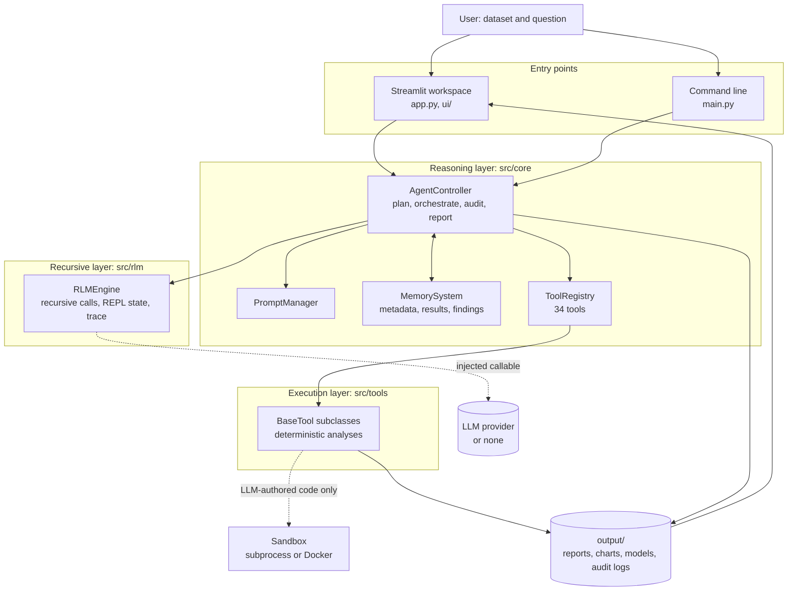

### Layers and rules

| Layer | Where | Responsibility |
| --- | --- | --- |
| Interface | `app.py`, `ui/`, `main.py` | Collect inputs, run the analysis on a worker thread, show progress and results. |
| Reasoning | `src/core/controller*.py`, `prompt_manager.py` | Plan, validate, orchestrate, audit and write up the analysis. |
| State | `src/core/memory.py`, `findings.py`, `profiler.py` | The external environment the LLM reads summaries of: metadata, results, findings, context. |
| Recursion | `src/rlm/engine.py` | Recursive LLM invocation with an external REPL-style environment and a trace. |
| Execution | `src/tools/` | Deterministic tools behind the `BaseTool` contract. |
| Governance | `src/core/governance.py`, `sandbox.py`, `security.py`, `privacy.py` | Upload checks, code sandbox, audit logs, LLM and PII controls. |

The dependency rules are enforced by `tests/test_architecture.py`:

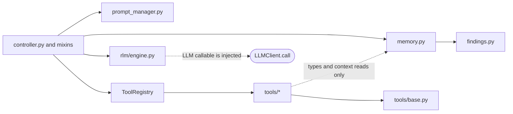

The controller reaches tools only through the registry and always calls
`BaseTool.run()`, never `execute()`. The engine knows nothing about memory,
tools or the controller. Tools never drive the engine or the controller.
`AGENTS.md` holds the full operating rules.

### Data flow

Two entry routes lead to the same pipeline. The upload route validates the file
before reading it. The command line reads the path you give it directly, so only
point it at files you trust.

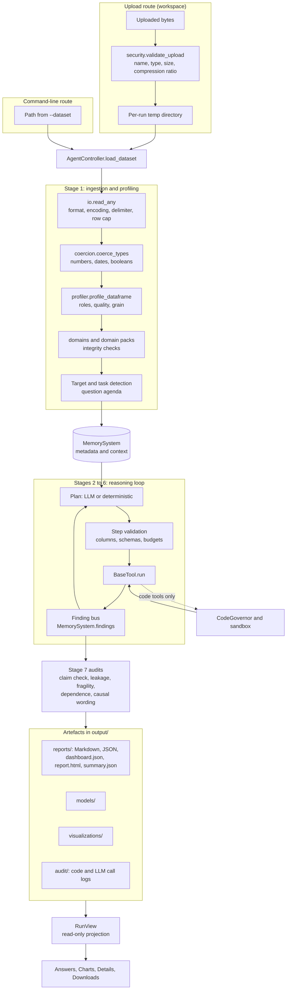

What reaches an LLM prompt is metadata, the data profile, tool summaries and
ranked findings, with dataset-derived text sanitised and personal-data columns
masked. Raw rows and full data frames do not.

### The seven-stage workflow

| Stage | Name | Where it happens |
| :---: | --- | --- |
| 1 | Dataset ingestion | `AgentController.load_dataset`, `io.py`, `coercion.py`, `profiler.py` |
| 2 | Initial reasoning | First `RLMEngine.invoke` call, or the deterministic fallback plan |
| 3 | Tool selection and execution | `StepMixin._execute_steps`, `tools/*` |
| 4 | Result interpretation | Second and later `RLMEngine.invoke` calls |
| 5 | Iterative refinement | The `for iteration` loop in `_reasoning_loop` |
| 6 | RLM decomposition | `_run_rlm_decomposition`, once per run, when enabled and the data is wide enough |
| 7 | Report generation | `_finalize_analysis`: audits, report, dashboard, HTML, run summary |

Stages 4 and 5 are one LLM call per later iteration: it reads the results so far
and returns the next plan or signals completion. Stage 6 runs inside the loop,
after the first plan has executed, not after the loop ends. The loop has several
exits, and every one of them reaches stage 7:

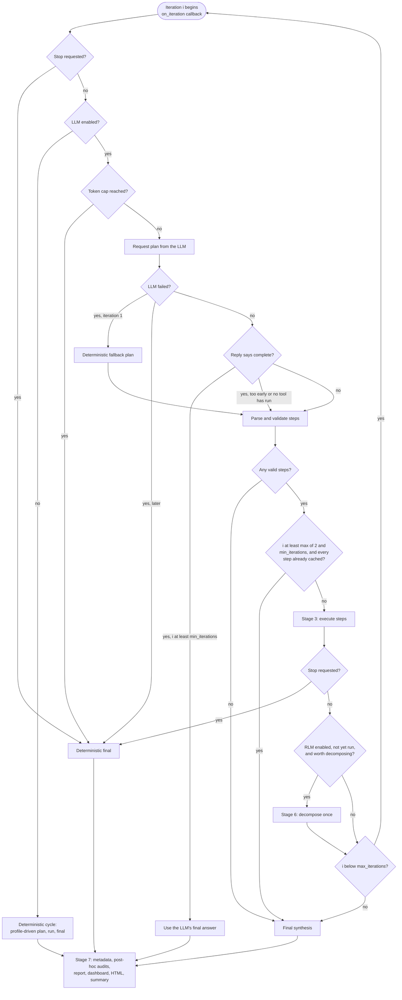

### Sequence diagrams

**A run from the workspace.** The analysis runs on its own thread so the page
stays responsive, can be stopped, and shows progress while it works.

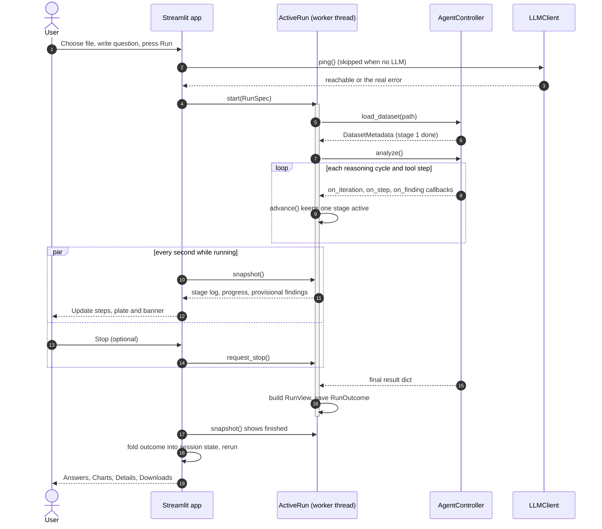

**One reasoning iteration with tool execution.**

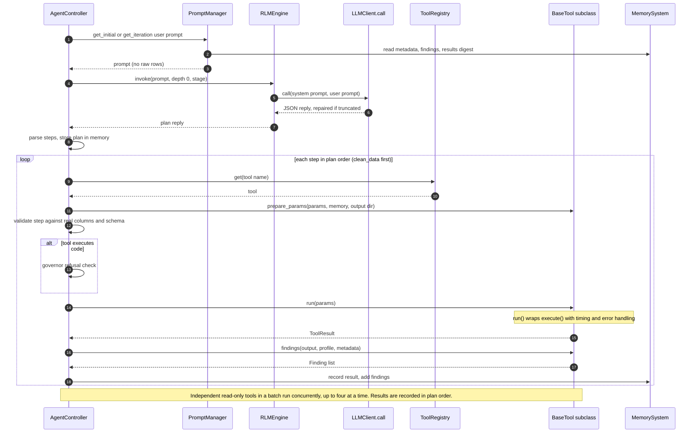

**Sandboxed, LLM-authored code.** The three code-executing tools
(`execute_dynamic_code`, `define_analysis_tool`, generated tools) share this path.

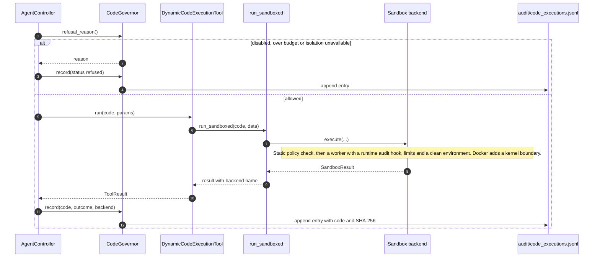

### Class diagrams

The engine core, trimmed to the types that carry the design. The tools shown are
four of the 34.

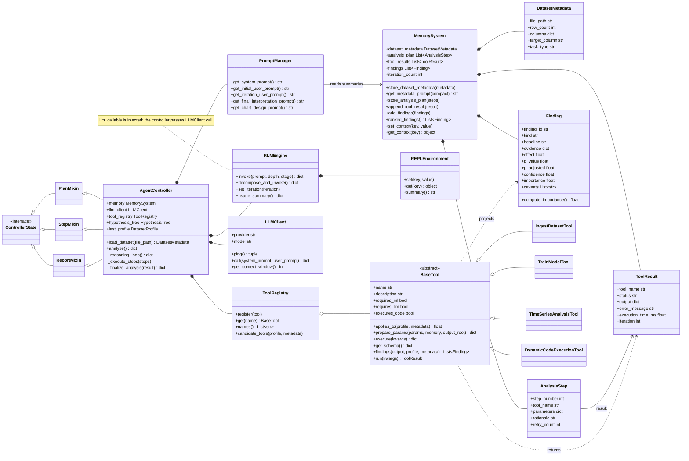

The run layer between the interface and the engine, and the final read model.

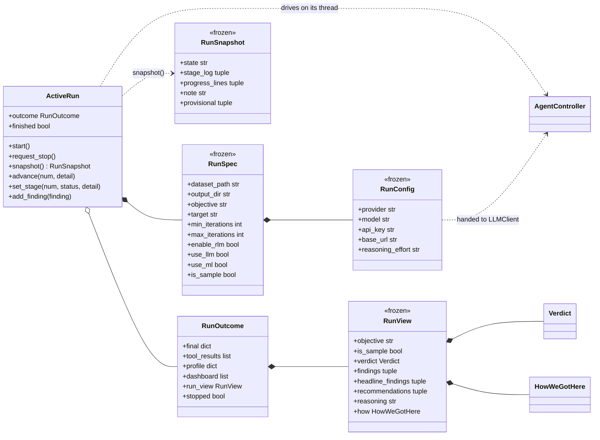

Execution, code sandboxing and governance:

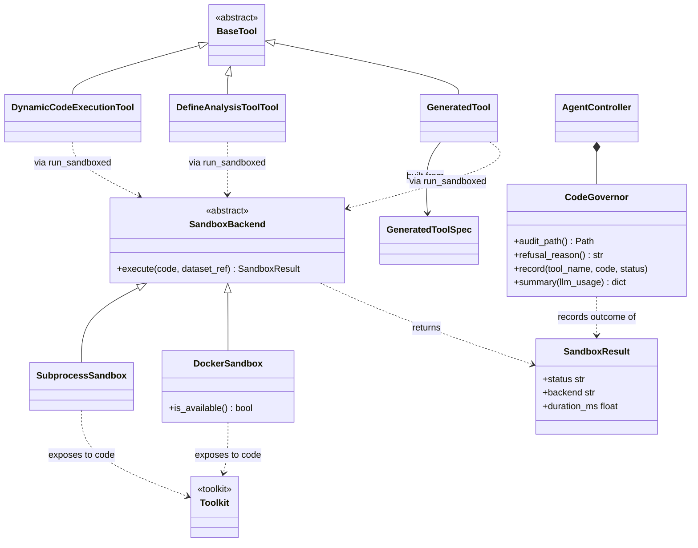

## The workspace

The Streamlit app (`app.py`, `ui/`) follows the path from file to answer rather
than a list of tools.

| Area | What it provides |
| --- | --- |
| Landing | A scroll-driven introduction (`ui/landing_component/`) with a pinned, four-stage 3D explanation of the pipeline. The 3D is optional polish with a plain-text equivalent. |
| Sidebar | File upload, the bundled sample, provider and model, analysis switches (LLM, ML, recursive decomposition, iterations) and the safety settings, which a shared-server operator controls. |
| Header band | The run's state and file, the seven steps with what each reported, and the workflow plate. Only one step reads "Working" at a time. |
| Run | Analysis on a worker thread with live step notes, "found so far" findings, a cooperative Stop, and a partial report when stopped. |
| Answers | The question as the heading, a verdict ("N of M checked findings held up"), ranked findings with their audit check marks, caveats, recommendations, and a search over findings. |
| Charts | Vega-Lite charts chosen to fit the data, each tied to the finding it supports, with the numbers behind it as a table. |
| Details | How the file was read and repaired, analyses specific to the data, the audit trail, models, governance and the step-by-step record. |
| Downloads | The report (HTML and Markdown), JSON results, models, the 3D presentation and the raw result. |

The look is the **Sorrel** design system: warm paper, near-black ink, a forest
green primary, an amber accent, Geist for the interface and an italic serif for
one accent word, in a Day and a Night theme. A tab is a warm band holding lighter
cards, and motion is reveals only (250 ms or less, off for reduced motion). All
colour comes from `src/core/design_tokens.py`; see [DESIGN.md](DESIGN.md) and
[DESIGN_LEARNINGS.md](DESIGN_LEARNINGS.md).

## Analyses and data

**Input.** The reader handles delimited text (CSV, TSV, gzip and ZIP), Excel
(`.xlsx`, `.xls`), JSON and JSON Lines, Parquet, Feather, HDF5, NetCDF, Stata,
SAS and SPSS files. It detects encoding and delimiter, flattens JSON to a depth
cap, finds subtotal rows and wide-time headers, and applies a row cap (default
one million, `DSA_MAX_ROWS`) with disclosed sampling. It reads **tables**: images,
audio, video and free-form documents are not analysed.

**Profiling and preparation.** Column roles (measure, category, date, identifier,
target, personal data), quality score, missingness mechanism, logical-constraint
and flatline checks, domain detection with domain packs (air quality, finance,
healthcare), related-file joins, and a question agenda that lists what a human
analyst would ask of this data.

**Question routing.** The objective is routed into analysis families (describe,
compare, associate, predict, explain, forecast, detect, segment, monitor, audit)
so the plan favours the right tools.

<details>
<summary><strong>The 34 registered tools</strong></summary>

Applicability depends on the profile and the question. A tool being registered
does not mean it runs on every upload, and a tool may decline when its
assumptions are not met. Flags: **ML** fits models (disabled by `--no-ml`),
**LLM** needs a reachable model, **code** runs LLM-authored code in the sandbox.

| Tool | Flags | What it does |
| --- | --- | --- |
| `ingest_dataset` | | Loads a file and reports schema, types, missingness, class balance and basic statistics. |
| `clean_data` | | Repairs types and reports missing values, duplicates and constant columns. |
| `detect_outliers` | | IQR, z-score or isolation-forest outliers, flagged rather than dropped. |
| `correlation_analysis` | | Correlation matrix, top pairs, correlation with the target. |
| `select_statistical_test` | | Picks and runs a test from normality, group count and data types. |
| `train_model` | ML | Several models with cross-validation, train/test gap and overfit warnings. |
| `evaluate_model` | ML | Evaluates a saved model on the same held-out split. |
| `cluster_data` | ML | KMeans segmentation with `k` chosen by silhouette score. |
| `dimensionality_analysis` | ML | PCA variance per component and highly correlated feature pairs. |
| `regression_analysis` | ML | OLS or logistic drivers on a lean predictor set. |
| `mixed_model_analysis` | ML | Random-intercept models for repeated or nested data. |
| `time_series_analysis` | | Trend, stationarity, autocorrelation and seasonality. |
| `forecast_analysis` | | Backtested forecasts over a regular series. |
| `change_analysis` | | Latest period against the prior period and the trailing average. |
| `anomaly_analysis` | | Spikes, dips, level shifts and unusual segments. |
| `survival_analysis` | | Kaplan-Meier time-to-event analysis with censoring. |
| `curve_fit_analysis` | | Linear, exponential, logistic and dose-response curve fits. |
| `segment_comparison` | | Lift of a measure across segments against the baseline, with intervals. |
| `concentration_analysis` | | How concentrated a measure is across entities. |
| `experiment_analysis` | | A/B-style tests with the test chosen automatically. |
| `cohort_analysis` | | RFM segments and repeat purchase from transaction data. |
| `basket_analysis` | | Items bought together. |
| `price_elasticity_analysis` | | Log-log price elasticity with robust intervals. |
| `financial_analysis` | | Returns, volatility, drawdown and Sharpe ratio for a price series. |
| `workforce_analysis` | | Headcount, tenure, attrition and pay distribution. |
| `equity_analysis` | | Outcome gaps between groups of a protected attribute. |
| `variable_scale_analysis` | | Circular, compositional and other scale-appropriate statistics. |
| `text_analysis` | | Vocabulary and frequent terms for a free-text column. |
| `geospatial_analysis` | | Bounding box, centroid and densest cells for coordinates. |
| `graph_analysis` | | Degree, components and PageRank for an edge list. |
| `generate_visualizations` | | Adds charts to the dashboard. |
| `generate_report` | | Assembles the Markdown and JSON report. |
| `execute_dynamic_code` | LLM, code | Runs LLM-written Python in the sandbox when no tool fits. |
| `define_analysis_tool` | LLM, code | Defines a named, reusable tool for later steps. |

</details>

**Model safeguards.** Where a model fits, the project ranks it on out-of-sample
evidence: stratified cross-validation (at least five folds) for independent
classification data, a chronological split for time series, a grouped split for
repeated entities, seeded randomness, a depth cap for trees, regularisation by
default, `cv_mean` as the comparison metric, and an overfit warning when the
train/test gap exceeds 0.10.

**Evidence checks on findings.** Confidence intervals and effect sizes, run-level
Benjamini-Hochberg control across all tests in a run, a causal-language guard
that downgrades causal wording for observational designs, target-leakage and
fragility audits, dependence-aware sample sizes, and small-group suppression.

## Safety, privacy and governance

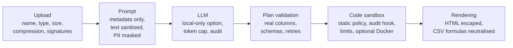

- **Upload boundary.** File names are sanitised, and type, size, compression
  ratio and binary signatures are checked before loading (workspace route).
- **Prompt boundary.** Raw rows never enter a prompt. Dataset- and code-derived
  text is sanitised and declared data, not instructions. Detected personal-data
  columns (email, phone, names, identifiers, cards, IP addresses) are masked.
- **LLM boundary.** `LOCAL_ONLY` refuses every non-local provider. A per-run
  token cap stops LLM calls and finishes deterministically. Calls are audited as
  hashes and sizes unless full text is switched on.
- **Code boundary.** LLM-authored code runs only through `src/core/sandbox.py`:
  a static policy, a runtime audit hook, an allowlisted environment with no
  credentials, process-tree limits, and optionally Docker with no network and a
  read-only root. New capabilities are methods on the pre-bound `dsa` toolkit,
  never a wider module allowlist.
- **Audit boundary.** Every execution and refusal is appended to
  `audit/code_executions.jsonl`, every LLM call to `audit/llm_calls.jsonl`. A run
  summary appears in the Details tab.
- **Models on disk.** Model files are HMAC-signed. An unsigned pickle is never
  loaded.

For datasets or questions from people you do not trust, use the Docker backend
and set `SANDBOX_REQUIRE_ISOLATION=true`. `DSA_HOSTED=true` turns on the hosted
defaults: code execution off and isolation required. The sandbox threat model is
documented at the top of `src/core/sandbox.py`.

## Configuration

Settings come from the environment (a `.env` file is read), and the workspace
sets the LLM connection per run rather than through the process environment, so
one visitor's key never reaches another's run. [`.env.example`](.env.example)
lists the common settings. The table below is built from what the code reads.

<details>
<summary><strong>All environment variables</strong></summary>

**LLM**

| Variable | Default | Effect |
| --- | --- | --- |
| `LLM_PROVIDER` | `openai` | `openai`, `anthropic`, `gemini`, `groq`, `openrouter`, `nvidia`, `local` or `ollama`. |
| `LLM_MODEL` | provider default | Model name. |
| `OPENAI_API_KEY`, `ANTHROPIC_API_KEY`, `GEMINI_API_KEY`, `GROQ_API_KEY`, `OPENROUTER_API_KEY`, `NVIDIA_API_KEY` | | Only the active provider's key is needed. |
| `LOCAL_LLM_BASE_URL`, `LOCAL_LLM_API_KEY`, `LOCAL_LLM_CONTEXT` | | An OpenAI-compatible local server (Ollama, LM Studio, vLLM) and its real context size. |
| `LLM_TEMPERATURE` | `0.2` | Sampling temperature. |
| `LLM_MAX_TOKENS`, `LLM_TIMEOUT`, `LLM_MAX_CONCURRENCY` | per stage and provider | Output cap, request timeout, simultaneous calls. |
| `LLM_CONTEXT_TOKENS` | model table | Prompt budget the planner prompts are compacted to fit. |
| `LLM_JSON_FORMAT` | `true` | Ask the provider for JSON mode. |
| `LLM_REASONING_EFFORT` | adaptive | `none`, `low`, `medium`, `high` or `adaptive`. |
| `LLM_RPM_LIMIT`, `LLM_TPM_LIMIT` | catalogue or headers | Per-minute request and token ceilings. `0` disables. |
| `PROMPT_COMPACT` | automatic | Force compact prompts. |
| `OPENROUTER_REFERER` | project URL | Referer sent to OpenRouter. |

**Analysis**

| Variable | Default | Effect |
| --- | --- | --- |
| `MIN_ITERATIONS`, `MAX_ITERATIONS` | `1`, `15` | Bound the reasoning cycles. |
| `ENABLE_RLM_INFERENCE` | `true` | Allow recursive decomposition. |
| `RLM_DECOMPOSE` | `auto` | Decomposition policy. |
| `RLM_MAX_DEPTH` | `5` | Maximum recursion depth. |
| `ENABLE_LLM`, `ENABLE_ML` | `true` | Defaults for the LLM and model-fitting switches. |
| `CHART_DESIGN` | on | Set `false` to skip the LLM chart-design pass. |
| `USER_OBJECTIVE`, `TARGET_COLUMN_HINT` | | Default question and target column. |
| `MAX_TRAIN_SAMPLES` | `50000` | Row cap when fitting models. |
| `DSA_MAX_ROWS` | `1000000` | Row cap when reading a file. |
| `DSA_ANALYSIS_SAMPLE_ROWS` | `200000` | Row count above which exploratory statistics run on a seeded random sample. |
| `ENABLE_TOOL_LIBRARY`, `GENERATED_TOOL_LIBRARY` | `false`, `output/tool_library` | Reuse validated generated tools across runs. |
| `OUTPUT_DIR` | `output` | Root of the artefacts. |

**Safety and hosting**

| Variable | Default | Effect |
| --- | --- | --- |
| `DSA_HOSTED` | `false` | Shared-server mode: code execution off, isolation required. |
| `ENABLE_CODE_EXECUTION` | `true` (`false` when hosted) | Hide and refuse every code-executing tool when `false`. |
| `MAX_CODE_EXECUTIONS` | `40` | Sandbox runs allowed per analysis. |
| `SANDBOX_BACKEND` | `subprocess` | `docker` adds a kernel boundary. |
| `SANDBOX_REQUIRE_ISOLATION` | `false` (`true` when hosted) | Run code only in Docker. |
| `SANDBOX_TIMEOUT_S`, `SANDBOX_MEMORY_MB` | `45`, `1024` | Wall-clock and memory limits per execution. |
| `SANDBOX_SECCOMP` | `true` | Apply the seccomp profile under Docker. |
| `REDACT_PII` | `true` | Mask personal-data values in prompts. |
| `LOCAL_ONLY` | `false` | Refuse every non-local LLM provider. |
| `MAX_LLM_TOKENS_PER_RUN` | `0` (off) | Token cap per analysis. |
| `AUDIT_LLM_FULL_TEXT` | `false` | Store full prompts and replies in the LLM audit log. |
| `DSA_MIN_CELL_SIZE` | `5` | Smallest group that may be reported by name. |
| `MAX_UPLOAD_MB`, `MAX_UNCOMPRESSED_MB`, `MAX_COMPRESSION_RATIO` | `200`, `500`, `100` | Upload limits. |
| `MAX_CONCURRENT_RUNS` | `4` | Analyses a server runs at once. |
| `DSA_LANDING_DIR` | | Serve the landing component from another directory. |

</details>

## Command line

`main.py` runs the same pipeline for repeatable runs and scripts.

| Option | Description |
| --- | --- |
| `--dataset`, `-d` | Required path to a supported file. |
| `--provider` | `openai`, `anthropic`, `gemini`, `openrouter`, `nvidia`, `local` or `ollama` (`groq` is available through `LLM_PROVIDER`). |
| `--model` | Override the provider's model. |
| `--local-base-url` | Point a local provider at a compatible server. |
| `--target` | Target-column hint. |
| `--objective` | The question, in plain language. |
| `--min-iterations`, `--max-iterations` | Bound the loop (default maximum 15). |
| `--no-rlm` | Disable recursive decomposition. |
| `--no-llm` | Fully deterministic: no LLM calls at all. |
| `--no-ml` | Skip every model-fitting tool. |
| `--output-dir` | Output root other than `output/`. |
| `--persist` | Persist memory as JSON at a path. |

The command line reads the given path directly and does not run the upload
validation that the workspace applies.

## Outputs

```text
output/
  reports/          Markdown report, JSON results, dashboard.json,
                    report.html, summary.json
  visualizations/   Chart images
  models/           Signed model files when training ran
  audit/            code_executions.jsonl, llm_calls.jsonl
  runs/             Run summaries kept for "compare with a previous run"
```

What exists depends on the tools that ran and on whether the run finished,
degraded or was stopped. Read any number together with its evidence and caveats.

## Quality assurance

```powershell
ruff check .
mypy src/
pytest tests/ -v
```

About 1,500 tests cover the tools, the controller, the sandbox, the memory and
finding model, the stylesheet and design tokens, and the application itself
(`tests/test_app_render.py` runs the real app in Streamlit's test harness).
`tests/test_architecture.py` checks the layer rules in this README.

Continuous integration (`.github/workflows/ci.yml`) runs on Windows and Ubuntu
with Python 3.13, and on Ubuntu with Python 3.11, the declared minimum:

- `ruff`, `mypy`, and `pytest -m "not slow"`
- `scripts/validate.py` and `scripts/dry_run.py`, which exercise the seven
  stages against a scripted mock LLM
- a performance budget (`scripts/bench.py --check`) that reports but does not
  block
- a browser smoke test (`scripts/ui_smoke.py`) that runs the bundled sample in
  Chromium and checks the result at phone width

Conventions for contributors and AI agents are in [AGENTS.md](AGENTS.md): type
hints everywhere, the `BaseTool` contract (a `summary` key, `ToolExecutionError`
for expected failures, seeded randomness, a test), and approval before changing
the RLM engine, task decomposition, the `MemorySystem` schema, or deleting
source files.

## Repository structure

```text
.
├── app.py                      Streamlit application
├── main.py                     Command-line entry point
├── src/
│   ├── core/
│   │   ├── controller.py       AgentController: loading, the reasoning loop, audits
│   │   ├── controller_planning.py, controller_steps.py, controller_report.py
│   │   │                       PlanMixin, StepMixin, ReportMixin
│   │   ├── memory.py           MemorySystem, DatasetMetadata, ToolResult, AnalysisStep
│   │   ├── findings.py         Finding and ranking
│   │   ├── prompt_manager.py   Every LLM prompt template
│   │   ├── llm_client.py       Provider calls, JSON repair, local-only
│   │   ├── io.py, coercion.py, profiler.py, security.py, privacy.py
│   │   ├── sandbox.py, sandbox_toolkit.py, governance.py, model_io.py
│   │   ├── dashboard*.py, chart_*.py, html_report.py
│   │   ├── run_config.py, run_view.py, design_tokens.py
│   │   └── ...                 domains, integrity, hypothesis, joins, statistics helpers
│   ├── rlm/engine.py           RLMEngine and REPLEnvironment
│   └── tools/                  34 BaseTool subclasses and shared helpers
├── ui/
│   ├── run.py                  ActiveRun, RunSpec, RunOutcome (worker thread)
│   ├── tabs/                   Answers, Charts, Details, Downloads
│   ├── components/             Cards, steps, provisional findings
│   ├── landing.py, landing_component/   The landing page
│   ├── pipeline_3d.py, cinematic_3d.py, assets/   The workflow plate and 3D export
│   └── styles.py               Theme and CSS injection
├── tests/                      Unit, integration, architecture and app-render tests
├── scripts/                    validate, dry_run, bench, ui_smoke, screenshots
├── data/                       Bundled demonstration datasets
├── docker/, Dockerfile         Sandbox image and hardening notes
├── static/                     Self-hosted fonts and vendored libraries
├── docs/                       Plans, improvement ledger, future scope
├── AGENTS.md, DESIGN.md        Engineering rules and the design system
└── output/                     Generated artefacts (runtime; never commit data)
```

## Roadmap

What follows comes from the planning documents in `docs/`. Items under
*Delivered* are in the code today; items under *Open* are not.

**Delivered since the original plan**

- Per-run configuration (`RunConfig`) so nothing about a run is process-wide, and
  a `DSA_HOSTED` mode for shared servers.
- A read-only `RunView` that every result screen reads, and a worker-thread run
  with live progress, provisional findings and a cooperative Stop.
- A real no-AI sample run in place of a fabricated demo.
- The Sorrel workspace and landing page, Day and Night themes, tokens in one
  module with a test that keeps them in sync.
- The controller split into planning, step and report mixins, and a browser smoke
  test in CI.

**Open**

- A property-driven expansion of analysis methods (messy-table layouts, parallel
  series, irregular events, spatial dependence, survey and experimental design,
  dataset comparison). See [docs/FutureScope.md](docs/FutureScope.md).
- One shared Three.js runtime across the landing page, the plate and the
  cinematic export, and a full device and accessibility matrix.
- Incremental analysis streaming beyond provisional findings, and chart
  cross-filtering.
- Dedicated unit tests for a few of the newer specialised tools, coverage
  measurement and structured runtime logging. See
  [docs/IMPROVEMENTS.md](docs/IMPROVEMENTS.md).
- A licence file. The repository does not yet declare one.

**Not goals.** Analysing raw images, audio, video or arbitrary documents,
replacing a data scientist, validating causal claims from observational data, or
treating a fluent LLM summary as proof.

## Limitations

- A file that loads is not necessarily read the way its author meant, especially
  report-style spreadsheets.
- Tool choice depends on the profile and the question. A method may correctly
  decline to run when its assumptions, sample size or structure are unsuitable.
- LLM synthesis can be incomplete or poorly framed. Claim verification checks
  numbers against executed results. It is not proof of scientific validity.
- The subprocess sandbox is designed against buggy or prompt-injected code, not a
  determined attacker. Use Docker with required isolation for untrusted input.
- A hosted deployment needs per-session isolation of configuration and output,
  and restricted execution rights.
- The landing page and the shareable HTML report ship their own fonts and chart
  libraries, so they open offline. If a vendored file is missing, the report
  falls back to a CDN link for that asset.

## Further reading

| Document | Contents |
| --- | --- |
| [AGENTS.md](AGENTS.md) | Operating rules, layer boundaries, the tool contract, governance controls. |
| [DESIGN.md](DESIGN.md), [DESIGN_LEARNINGS.md](DESIGN_LEARNINGS.md) | The Sorrel design system, motion rules and the audit behind them. |
| [docs/IMPROVEMENTS.md](docs/IMPROVEMENTS.md) | The improvement ledger and design decisions. |
| [docs/FutureScope.md](docs/FutureScope.md) | Planned analysis extensions. |
| [docs/FrontendOverhaulPlan.md](docs/FrontendOverhaulPlan.md) | The frontend plan and its decision log. |
| [docker/README.md](docker/README.md) | The sandbox image and its hardening. |
| [THIRD_PARTY_UI.md](THIRD_PARTY_UI.md) | Third-party UI code, its licences and what was only inspiration. |

## Contact

For bugs, feature requests or academic questions, open an issue in the
repository.
