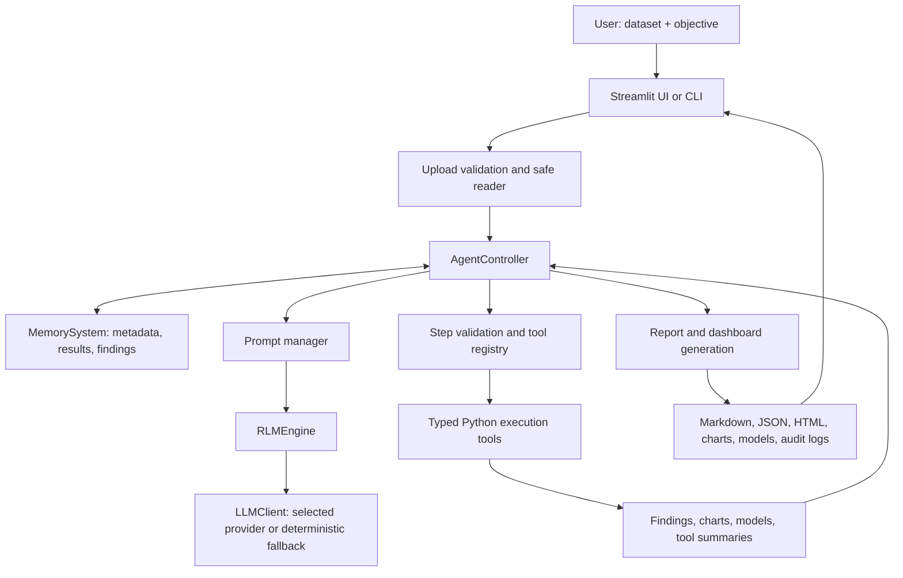
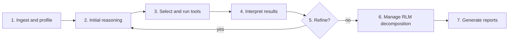

# Sorrel — Autonomous Data Analysis and Interpretation System

[](https://www.python.org/)
[](LICENSE)
[]()

Sorrel is a final-year B.Tech CSE project that turns a tabular dataset and
a plain-language question into an auditable analysis. It profiles the data,
selects suitable deterministic analysis tools, optionally uses an LLM to plan
and interpret the workflow, checks the evidence behind reported claims, and
creates reports and visualisations that a non-specialist can inspect.

The project is deliberately built around one rule: **reasoning and execution
are different responsibilities**. LLMs decide how to approach an objective
from controlled metadata and tool results; typed Python tools perform data
processing, statistics, model fitting, charting, and report generation.

> **Project status:** The analysis platform and Streamlit workspace are active.
> A full frontend visual overhaul and several data-method extensions are
> planned, not complete. The roadmap below labels those items clearly.

> **Academic-project notice:** This is a demonstration system, not a clinical,
> legal, financial, or compliance decision system. Do not upload sensitive or
> regulated data to a hosted deployment. When an online LLM is enabled,
> controlled summaries may be sent to the selected provider.

## Table of contents

- [Problem and objectives](#problem-and-objectives)
- [What exists now](#what-exists-now)
- [Architecture](#architecture)
- [Analysis workflow](#analysis-workflow)
- [Supported data and analyses](#supported-data-and-analyses)
- [Interfaces and outputs](#interfaces-and-outputs)
- [Installation and usage](#installation-and-usage)
- [Configuration and safety](#configuration-and-safety)
- [Quality assurance](#quality-assurance)
- [Roadmap](#roadmap)
- [Limitations](#limitations)
- [Repository structure](#repository-structure)

## Problem and objectives

Many data-analysis tasks need several kinds of judgement at once: understanding
the file layout, determining whether data are fit for analysis, choosing a
valid statistical method, avoiding model leakage, checking assumptions, and
communicating results without hiding uncertainty. Repeating that workflow by
hand is slow and inconsistent, especially for users who do not work with data
every day.

DSA Agent aims to make this workflow more approachable while retaining a
defensible trail from a user question to a result. Its objectives are to:

- accept common tabular datasets and reveal their structure and quality;
- translate a plain-language question into a bounded analysis plan;
- execute deterministic, reusable Python tools rather than letting an LLM
  calculate from raw rows;
- choose methods conditionally on dataset properties such as targets, time,
  repeated entities, text, coordinates, or transaction structure;
- surface evidence, uncertainty, effect sizes, degradation notes, and model
  validation information with each result;
- generate shareable Markdown, JSON, dashboard, chart, and HTML artefacts;
- make safety controls, LLM use, and dynamically executed code visible and
  auditable.

## What exists now

### End-to-end capabilities

The current system can:

- ingest a supported file through the Streamlit interface or command line;
- safely validate, sanitise, decode, and profile the upload;
- infer roles such as numeric, categorical, datetime, identifier, target, or
  likely sensitive fields;
- clean and transform data with an explicit account of the treatment applied;
- run a profile-driven sequence of specialised tools;
- invoke an LLM through a provider adapter for planning and interpretation, or
  complete a deterministic no-LLM path;
- recursively decompose suitable planning tasks using an external REPL-style
  environment when RLM is enabled;
- verify numerical claims in generated synthesis against tool output;
- show an answers-first workspace with Charts, Details, and Downloads tabs;
- emit reports, dashboard specifications, visualisations, models, and audit
  records under the run output directory.

### Reliability and interpretation features

Several controls are already part of the analysis path rather than cosmetic
post-processing:

- Metadata—not raw dataset rows—is used for planner prompts.
- Data-quality, coercion, degradation, and sufficiency notes travel with the
  run so a weak input is not presented as a strong conclusion.
- Statistical findings include relevant checks such as confidence intervals,
  effect-size or practical-significance context, and run-level multiple-testing
  control where applicable.
- Model training uses validation appropriate to the data shape: stratified
  folds for i.i.d. classification, time-aware splits for chronological data,
  and group-aware splits for repeated entities. It records cross-validation
  performance, train/test gaps, and overfit warnings.
- The claim-verification layer flags synthesis numbers that cannot be traced to
  executed results.
- Dashboard specifications aggregate data where possible instead of embedding
  large raw-row payloads in every chart.
- Small groups can be suppressed or folded into an aggregate to reduce
  disclosure risk in displayed results.

### Current user experience

The Streamlit application currently provides:

| Area | What it provides today |
| --- | --- |
| Landing and upload | A product entry surface, file upload, bundled sample-data path, dataset preview, and objective input. |
| Configuration | Provider, model, reasoning, analysis, and output settings appropriate to the active run. |
| Run state | Progress reporting from worker callbacks, a cooperative Stop action, and partial-result handling. |
| Answers | Findings-led summary, evidence, caveats, recommendations, and key metrics. |
| Charts | Data-driven Vega-Lite chart specifications plus table alternatives where available. |
| Details | Dataset profile, tool output, run trace, methodology, degradation, and governance detail. |
| Downloads | Generated reports, chart/dashboard artefacts, models when applicable, and a cinematic workflow export. |
| Workflow plate | A seven-stage text fallback with an optional 3D process visual. |

The existing visual layer is functional but is being redesigned; see
[Frontend overhaul](#frontend-overhaul-planned) for the planned replacement.

## Architecture

### System map



### Layers and responsibilities

| Layer | Main location | Responsibility |
| --- | --- | --- |
| Interface | `app.py`, `ui/`, `main.py` | Collect inputs, display run state/results, and expose downloadable artefacts. |
| Reasoning | `src/core/controller.py`, `prompt_manager.py` | Plan, validate, orchestrate, interpret, and refine the analysis workflow. |
| State | `src/core/memory.py`, findings/profile modules | Preserve metadata, context, results, findings, and degradation information. |
| Recursive workflow | `src/rlm/engine.py` | Manage recursive LLM invocation and the REPL-style analysis environment. |
| Execution | `src/tools/` | Perform deterministic analysis, modelling, visualisation, and report actions. |
| Governance | `src/core/governance.py`, `sandbox.py`, `security.py` | Restrict dangerous actions, validate uploads, audit execution, and enforce LLM/data controls. |

The controller uses `BaseTool.run()` to execute registered tools. Each tool has
a schema, deterministic defaults where randomness is involved, structured error
handling, and a `summary` result field. Execution tools do not drive the
controller or RLM engine directly.

### Recursive workflow management

RLM in this project is an **inference-time scaffold**, not a trained model or
a claim of unlimited reasoning. It stores accumulated analysis context in an
external REPL-like environment and allows suitably scoped subtasks to be
invoked recursively. This keeps prompts centred on metadata and relevant
result summaries instead of repeatedly placing an entire dataset or every
previous output into a model context.

The normal application still works without RLM (`--no-rlm`) and without any
LLM (`--no-llm`). Those modes are important for reproducible demonstrations,
offline/local workflows, and troubleshooting.

## Analysis workflow

Every run follows the same seven-stage model.



1. **Dataset ingestion:** The reader validates the file, loads the table,
   records exactly how it was interpreted, and profiles schema and quality.
2. **Initial reasoning:** The controller builds a constrained plan from the
   objective, profile, tool schemas, and available safeguards.
3. **Tool selection and execution:** Registered tools receive resolved,
   validated parameters and return structured outputs and findings.
4. **Result interpretation:** The system connects results to the objective and
   checks whether the evidence supports the language used.
5. **Iterative refinement:** Further steps are considered only while they add
   relevant information and remain within configured limits.
6. **RLM workflow management:** When enabled and appropriate, complex planning
   work is decomposed into bounded recursive subtasks.
7. **Report generation:** The final result is converted into human-readable
   reports, visual artefacts, dashboard data, and governance summaries.

## Supported data and analyses

### Input formats

The unified reader currently supports the following table-oriented formats:

| Family | Formats |
| --- | --- |
| Delimited text | CSV, TSV, gzip-compressed CSV/TSV, and ZIP-compressed CSV/TSV |
| Spreadsheet | Excel `.xlsx` and `.xls` |
| Structured data | JSON, JSON Lines, and Parquet |
| Statistical packages | Stata `.dta`, SAS `.sas7bdat`/`.xpt`, SPSS `.sav`/`.zsav` |
| Columnar/scientific tables | Feather, HDF5, and NetCDF |

The reader includes encoding and delimiter detection, JSON flattening with a
depth cap, and a configurable row cap with disclosed reservoir sampling where
needed. Its support is for **tabular** analysis. Raw images, audio, video,
documents, binaries, and point clouds are not directly analysed.

### Data understanding and preparation

| Capability | Current behaviour |
| --- | --- |
| Profiling | Inspects columns, types, missingness, duplicates, cardinality, target candidates, profile sufficiency, and quality signals. |
| Type/format coercion | Repairs recognised numeric, percentage, currency, boolean, and date representations while recording the conversion. |
| Cleaning | Handles missing values, duplicate/constant/identifier concerns, and prepared analysis paths with recorded treatments. |
| Outliers | Provides distribution-aware outlier analysis and flags rather than silently discarding observations. |
| Relationships | Finds correlations and other supported associations, while respecting role and sufficiency checks. |
| Privacy-aware display | Detects PII-sensitive columns and supports small-cell suppression in group outputs. |
| Relational data | Includes auto-join and relationship analysis support for compatible tabular sources. |

### Tool library

The tool registry contains the following current analysis domains. Applicability
depends on the dataset profile and question; the presence of a tool does not
mean it will run for every upload.

| Domain | Tools and examples |
| --- | --- |
| Core preparation | Ingestion, cleaning, outlier detection, correlation analysis, visualisation, and report generation. |
| Statistics | Statistical-test selection, regression, variable-scale analysis, concentration analysis, segment comparison, mixed models, experiments, and change analysis. |
| Predictive and unsupervised ML | Training, evaluation, clustering, and dimensionality analysis. |
| Time and curves | Time-series analysis, forecasting, curve fitting, survival analysis, and cohort analysis. |
| Business and behavioural data | Basket analysis, price elasticity, financial analysis, workforce analysis, and equity analysis. |
| Text, location, and network data | Text analysis, geospatial analysis, and graph analysis. |
| Advanced extension path | Sandboxed dynamic code execution, generated tools, and LLM-authored analysis-tool definitions when operator controls permit them. |

### Machine-learning safeguards

Where a model is appropriate, the project prioritises out-of-sample evidence
over training accuracy:

- five-fold-or-greater stratified cross-validation for i.i.d. classification;
- chronological splits for time-series data and group-aware splits for panels;
- a seeded random state for reproducible stochastic operations;
- configurable tree-depth caps and regularisation-aware model choices;
- `cv_mean` as the primary comparison metric;
- train/test gap reporting and an overfit warning when the gap exceeds 0.10.

Models are useful only when the data and objective support them. The platform
can analyse a dataset without training one (`--no-ml`).

## Interfaces and outputs

### Streamlit application

Start the application with `streamlit run app.py`. The UI is designed around
the path from upload to answer rather than around a raw list of tools. Its
four top-level result tabs are **Answers**, **Charts**, **Details**, and
**Downloads**. The Details tab keeps run traces and technical material out of
the main answer path without hiding them.

### Command-line interface

`main.py` exposes the same core pipeline for repeatable runs and scripts. Key
options are:

| Option | Description |
| --- | --- |
| `--dataset`, `-d` | Required path to a supported dataset. |
| `--provider` | Choose `openai`, `anthropic`, `gemini`, `openrouter`, `nvidia`, `local`, or `ollama`. |
| `--model` | Override the selected provider's model. |
| `--local-base-url` | Point a local/Ollama provider at a compatible server. |
| `--target` | Supply a target-column hint. |
| `--objective` | State the question in plain language. |
| `--min-iterations`, `--max-iterations` | Bound the planning/execution loop. |
| `--no-rlm` | Disable recursive decomposition. |
| `--no-llm` | Use the deterministic pipeline and deterministic synthesis only. |
| `--no-ml` | Skip all model-fitting tools. |
| `--output-dir` | Select an output root other than `output/`. |
| `--persist` | Persist memory JSON to a supplied path. |

### Generated artefacts

```text
output/
  reports/          Markdown reports, JSON results, dashboard data, HTML reports
  visualizations/   Generated chart images
  models/           Persisted model files when training is enabled
  audit/            Code-execution and LLM-call audit logs
```

The exact artefacts depend on the chosen tools and whether a run completes,
degrades, or is stopped early. Generated numbers must be read together with
their evidence and caveats; an output is not a substitute for expert review.

## Installation and usage

### Prerequisites

- Python 3.11 or newer
- `pip` and a virtual environment tool
- An API key only for the selected online provider
- Docker only when using the stronger Docker sandbox backend

### Set up the project

```powershell
py -3.11 -m venv .venv
.\.venv\Scripts\Activate.ps1
pip install -r requirements.txt
Copy-Item .env.example .env
```

`requirements.lock` is included for reproducible pinned environments. Never
commit `.env`, API keys, output artefacts containing sensitive data, or large
private datasets.

### Run a deterministic sample

The bundled churn dataset can exercise the no-LLM path without a cloud key:

```powershell
python main.py --dataset data/sample_customer_churn.csv --target churn --no-llm
```

### Run with an objective and an LLM

Configure only the key for the chosen provider in `.env`, then run:

```powershell
python main.py --dataset data/sample_customer_churn.csv `
  --target churn `
  --objective "What factors are most associated with customer churn?"
```

Or launch the graphical workspace:

```powershell
streamlit run app.py
```

Run `python main.py --help` for the current command-line reference.

## Configuration and safety

The complete configuration reference is [`.env.example`](.env.example). The
most important controls are summarised below.

| Setting | Default | Effect |
| --- | --- | --- |
| `LLM_PROVIDER` / `LLM_MODEL` | `openai` / provider default | Select the provider and model. |
| `MAX_ITERATIONS` | `15` | Bound reasoning/execution cycles. |
| `ENABLE_RLM_INFERENCE` | `true` | Enable recursive task decomposition. |
| `OUTPUT_DIR` | `output` | Select the root for generated artefacts. |
| `LOCAL_ONLY` | `false` | Reject cloud providers; allow only local/Ollama providers. |
| `ENABLE_CODE_EXECUTION` | `true` | Hide and refuse code-executing tools when false. |
| `MAX_CODE_EXECUTIONS` | `40` | Cap sandboxed code runs in one analysis. |
| `SANDBOX_BACKEND` | `subprocess` | Use the subprocess sandbox or Docker sandbox. |
| `SANDBOX_REQUIRE_ISOLATION` | `false` | Require Docker and refuse subprocess fallback. |
| `SANDBOX_TIMEOUT_S` / `SANDBOX_MEMORY_MB` | `45` / `1024` | Limit sandbox runtime and memory. |
| `REDACT_PII` | `true` | Redact detected personal-data values in prompts. |
| `MAX_LLM_TOKENS_PER_RUN` | `0` | Cap LLM token use; zero disables the cap. |
| `AUDIT_LLM_FULL_TEXT` | `false` | Keep audit records as hashes and sizes unless explicitly enabled. |

### Security model

The security architecture is designed to make the most sensitive boundaries
explicit:

- **Upload boundary:** file names are sanitised; file type, size, compression
  ratio, archive entry count, and binary signatures are checked before loading.
- **Prompt boundary:** raw rows are not passed directly to LLM prompts;
  dataset/code-derived text is sanitised and marked as data.
- **Code boundary:** LLM-authored code executes only through the sandbox. The
  sandbox uses an allowlisted environment and a pre-bound `dsa` toolkit rather
  than broad module and filesystem access.
- **Audit boundary:** code executions and refusals are written to
  `audit/code_executions.jsonl`. LLM calls are written to
  `audit/llm_calls.jsonl` with hashes, sizes, and token-use information.
- **Rendering boundary:** user- and model-derived text is escaped before it is
  inserted into HTML reports or the application.

For datasets or objectives from unknown users, use the Docker backend and set
`SANDBOX_REQUIRE_ISOLATION=true`. A public demonstration deployment should
normally disable code execution unless Docker isolation is available.

## Quality assurance

The project uses static, type, architectural, unit, integration, and
frontend-contract checks. The core verification commands are:

```powershell
ruff check .
mypy src/
pytest tests/ -v
```

The intended acceptance path also includes an end-to-end sample CSV run that
creates a populated Markdown report in `output/reports/`. The application has
tests for major behaviours and architecture boundaries, while a small set of
newer specialised tools still needs dedicated unit coverage; that gap is
tracked in `docs/IMPROVEMENTS.md` and the roadmap rather than being hidden.

Repository conventions are defined in `AGENTS.md`. In particular, new tools
must use type hints, follow the `BaseTool` contract, return a `summary`, and
receive tests. Changes to the RLM engine, task-decomposition logic,
`MemorySystem` schema, or source-file deletion require explicit approval.

## Roadmap

The following work is planned. It is not represented as current product
behaviour. Detailed decisions, risks, and acceptance criteria are maintained
in `docs/FrontendOverhaulPlan.md`, `docs/FutureScope.md`, and `docs/IMPROVEMENTS.md`.

### Frontend overhaul (planned)

The next major project track is a visual and structural overhaul of every
user-facing surface: landing, Streamlit workspace, workflow plate, cinematic
export, and shareable HTML report. The desired experience is answers-first:
show the plain-language answer, evidence, caveat, and next action before
technical machinery.

| Priority | Planned work |
| --- | --- |
| Must | Establish a verified baseline; eliminate hosted-session leaks; pass per-run configuration explicitly; create a typed read-only `RunView`; replace fabricated preview content with a real deterministic sample run; state the data path honestly; make reports offline and print-ready; refresh examiner-facing documentation. |
| Should | Close visual-token drift; split oversized UI modules; add per-session run directories and Streamlit UI smoke tests; build a static-first landing; redesign workspace empty, running, and completed states; retain a text-first workflow timeline. |
| Deferred | Unify all Three.js runtimes; rebuild the cinematic export around native scroll; conduct the full device/accessibility matrix; add full incremental analysis streaming; add chart cross-filtering. |

The 3D visual remains optional explanatory polish. It must have a complete
text, reduced-motion, keyboard, and no-WebGL fallback, and it must never be
needed to understand a finding or obtain a report.

### Analysis-quality extensions (planned)

`docs/FutureScope.md` proposes a property-driven expansion of the system so new
methods are triggered by data structure rather than by arbitrary industry
labels. Major planned groups include:

| Area | Examples of planned additions |
| --- | --- |
| Messy-table understanding | Detect report-style sheets, multi-row headers, several tables per sheet, subtotal rows, and wide-time layouts; offer safe reshaping. |
| Data structures | Improve handling for many parallel series, irregular events, trajectories, relational data, graph edge lists, spatial dependence, sequences, curves, compositions, aggregates, and vector-valued cells. |
| Measurement and quality | Detect counts/rates/exposures, zero inflation, circular data, heavy tails, digit preference, currencies/units, hierarchical codes, batch effects, reporting delays, revisions, and schema drift. |
| Statistical validity | Add stronger checks for dependence, seasonality, regime changes, survey design, experimental blocking, selection bias, and aggregation limits. |
| Comparative analysis | Compare dataset versions, surface drift, and improve reproducible evidence for conclusions across repeated runs. |
| Testing and observability | Add missing specialised-tool tests, coverage measurement, structured runtime logging, and deeper performance/reproducibility checks. |

These additions will be gated by profile applicability and should disclose when
the method does not apply instead of producing a misleading default statistic.

### Explicit non-goals

The project does not currently aim to directly analyse raw non-tabular media
such as images, audio, video, or arbitrary documents. It also does not claim
to replace a data scientist, validate causal claims from observational data,
or guarantee correctness merely because an LLM generated a fluent summary.

## Limitations

- Supported file formats can be read as tables; successful loading does not
  guarantee that a sheet/layout has been interpreted exactly as its author
  intended.
- Tool selection is profile- and objective-dependent. A method may correctly
  decline to run when assumptions, sample size, or structure are unsuitable.
- LLM synthesis can still be incomplete or poorly framed. Claim verification
  helps with numerical grounding but is not a proof of scientific validity.
- Hosted deployment requires extra care: configuration and output isolation
  must be enforced per session, and execution privileges must be restricted.
- Browser-side third-party dependencies and presentation consistency across all
  surfaces are still being addressed by the frontend overhaul.
- Several specialised tools need additional direct unit-test coverage.
- The roadmap is deliberately broader than the fixed final-year-project scope;
  the Must/Should/Deferred priorities in `docs/FrontendOverhaulPlan.md` define what
  should be delivered first.

## Repository structure

```text
.
├── app.py                     # Streamlit application entry point
├── main.py                    # CLI entry point
├── src/
│   ├── core/                  # Controller, memory, prompts, IO, safety, reports
│   ├── rlm/                   # Recursive LLM engine and REPL environment
│   └── tools/                 # Deterministic execution tools
├── ui/                        # Landing, tabs, components, styles, 3D assets
├── tests/                     # Unit, integration, architecture, UI contract tests
├── data/                      # Bundled demonstration datasets
├── docker/                    # Sandbox image requirements and hardening notes
├── output/                    # Generated artefacts (runtime; do not commit data)
├── AGENTS.md                  # Project architecture and engineering rules
└── docs/                      # IMPROVEMENTS.md (ledger), FutureScope.md, frontend plans
```

## License

This project is licensed under the [MIT License](LICENSE).

## Contact

For bugs, feature requests, or academic-project questions, open an issue in
the repository.
